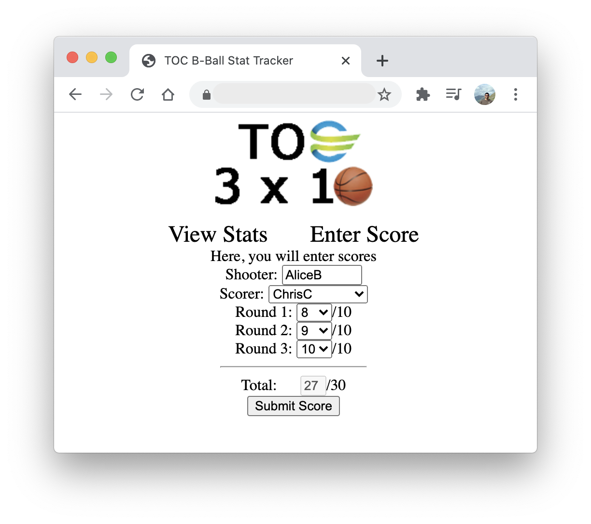

# TOC B-Ball

This repo houses old (5+ years old) code that I wrote for a simple webapp to track a game we used to play during breaks
at a previous employer. It *was* written in the days of PHP5, however I just quickly migrated it to use 
[`mysqli`](https://www.php.net/manual/en/book.mysqli.php) and prepared statements.

**TL;DR:** We had a basketball hoop, and would shoot free throws.
We would count the number of free throws we could make - this webapp would help us keep a scoreboard for us. A simple game, yet fun!

### Installation
1. Create the database; `tocbballstats.sql` includes the database and table schemas.
1. `cp variables.inc.example.php variables.inc.php`
1. Edit `variables.inc.php` with the database details.
1. Upload the following files to a host with PHP 7+ & network connectivity to the MySQL DB
    - `{.htaccess,*.php,*.css,*.png}`

### Screenshots
|         View Stats           |           Enter Score           |
:-----------------------------:|:--------------------------------:
 | 

